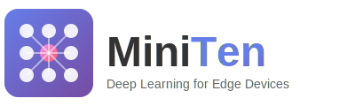

<p align="center">
  
</p>

<h1 align="center">MiniTen</h1>

<p align="center">
  <strong>A Lightweight Deep Learning Framework Optimized for Edge Platforms</strong>
</p>

<p align="center">
  <a href="https://github.com/sumeshthakr/MiniTen/actions/workflows/ci.yml"></a>
  <a href="https://www.python.org/downloads/"></a>
  <a href="https://opensource.org/licenses/MIT"></a>
  
  
</p>

---

## 🎯 Vision

MiniTen is a high-performance deep learning library designed from the ground up for edge computing. Built purely in Python and Cython with **minimal external dependencies**, MiniTen delivers exceptional performance in a fraction of the size of traditional frameworks like TensorFlow and PyTorch.

### Why MiniTen?

| Feature | MiniTen | PyTorch | TensorFlow |
|---------|---------|---------|------------|
| **Size** | ~1 MB | ~1.5 GB | ~2 GB |
| **NumPy Required** | Minimal | Yes | Yes |
| **Custom FFT/DSP** | ✓ Built-in | ✗ External | ✗ External |
| **Edge Optimized** | ✓ | ✗ | TF Lite |
| **Autograd** | ✓ | ✓ | ✓ |
| **RL Built-in** | ✓ | ✗ | ✗ |

- **🚀 Optimized for Edge**: Designed specifically for edge platforms (IoT devices, mobile, embedded systems)
- **📦 Minimal Footprint**: Fraction of the size compared to TensorFlow/PyTorch
- **⚡ High Performance**: Highly optimized Cython implementations with SIMD-like vectorization
- **🎓 Educational**: Clear, well-documented code showing how deep learning works internally
- **🔧 Modular**: Easy to understand, extend, and contribute to
- **🌐 GPU Support**: Supports CUDA, OpenCL, Metal, and Vulkan for edge GPUs
- **🔋 Power Efficient**: Optimized for low-power edge computing scenarios
- **🔢 Minimal NumPy**: Custom implementations for FFT, DSP, and core operations

## 📸 Demo

<details>
<summary>Click to see MiniTen in action</summary>

```
============================================================
         MiniTen Feature Demonstration
    Lightweight Deep Learning for Edge Devices
============================================================

============================================================
 1. TENSOR WITH AUTOGRAD
============================================================

Creating tensors with autograd support:
  x = [[1.0, 2.0], [3.0, 4.0]]
  w = [[0.5, 0.3], [0.2, 0.4]]

Forward pass (y = x @ w):
  y = [[0.9, 1.1], [2.3, 2.5]]

Loss (sum of y) = 6.8

Gradients after backward():
  x.grad = [[0.7, 0.7], [0.7, 0.7]]
  w.grad = [[3.0, 3.0], [7.0, 7.0]]

============================================================
 2. SIGNAL PROCESSING (Custom FFT - No External Dependencies!)
============================================================

Generated sine wave: 5 Hz, 100 Hz sample rate
FFT Results (first 10 frequency bins):
  Magnitudes: [1.71, 2.21, 4.41, 29.37, 8.01, 3.82, 2.6, 2.01, 1.65, 1.42]
Peak detection found 5 peaks at indices: [5, 25, 45, 65, 85]...

============================================================
 3. AUDIO PROCESSING (Custom MFCC, Spectrograms)
============================================================

Created audio signal: 440 Hz (A4 note)
Spectrogram computed: 129 frequency bins x 22 time frames
MFCC features: 13 coefficients

============================================================
 4. NLP UTILITIES
============================================================

Input: "MiniTen is a lightweight deep learning framework for edge devices!"
Word tokens: ['miniten', 'is', 'a', 'lightweight', 'deep', 'learning', ...]
Vocabulary built: 13 tokens
TF-IDF computed with vector length: 13

============================================================
 5. REINFORCEMENT LEARNING
============================================================

GridWorld Environment (5x5) - Q-Learning trained in 100 episodes
DQN Agent for CartPole created with hidden_sizes=[32, 32]

============================================================
 SUMMARY: All demos passed! ✓
============================================================
```

</details>

## ✨ Features

### 🧠 Core Features (NEW!)
- **Complete Tensor with Autograd**: Full automatic differentiation engine
- **Custom FFT Implementation**: No NumPy dependency for signal processing
- **SIMD-like Optimizations**: 4-way and 8-way vectorized operations
- **GPU Kernel Optimization**: Optimized kernels for edge GPUs

### 🤖 Neural Network Architectures
- **CNNs**: Convolutional Neural Networks for computer vision
- **RNNs**: Recurrent Neural Networks for sequential data
- **LSTMs**: Long Short-Term Memory networks
- **GRUs**: Gated Recurrent Units
- **GNNs**: Graph Neural Networks
- **Transformers**: Attention-based models with multi-head attention

### 📊 Data Processing (All with Custom Implementations!)
- **Vision**: Image processing, augmentation, and transforms
- **Audio**: Spectrograms, MFCC, resampling (custom FFT!)
- **Video**: Frame extraction, motion detection, optical flow
- **Text/NLP**: Tokenizers, vocabulary, TF-IDF, embeddings
- **Signal**: FFT, filters, wavelets, peak detection

### 🎮 Reinforcement Learning (`miniten.rl`)
- **Q-Learning**: Tabular Q-learning for discrete spaces
- **DQN**: Deep Q-Network with replay buffer
- **REINFORCE**: Policy gradient algorithm
- **Environments**: GridWorld, CartPole built-in

### 📈 Visualization Engine (`miniten.viz`)
- Fast Cython-based rendering (no matplotlib needed)
- Line plots, scatter plots, bar charts, histograms
- Image display and heatmaps
- Export to PNG/SVG formats

### 🔧 Training Monitor (`miniten.monitor`)
- Metrics logging (loss, accuracy, custom metrics)
- Callbacks: EarlyStopping, ModelCheckpoint, ProgressBar
- Experiment tracking and comparison
- HTML dashboard generation

### 🚀 Edge Deployment (`miniten.edge`)
- Model quantization (INT8, INT16)
- Weight pruning (magnitude, structured)
- Model compression (distillation, weight sharing)
- Export to ONNX and TFLite-compatible formats
- Benchmarking tools (latency, throughput, memory)

## 🚀 Quick Start

### Installation

```bash
# Clone the repository
git clone https://github.com/sumeshthakr/MiniTen.git
cd MiniTen

# Install dependencies
pip install -r requirements.txt

# Build and install
python setup.py build_ext --inplace
pip install -e .
```

### Basic Example - Tensor with Autograd

```python
from miniten.core import Tensor, zeros, randn

# Create tensors with automatic differentiation
x = Tensor([[1, 2], [3, 4]], requires_grad=True)
w = Tensor([[0.5, 0.3], [0.2, 0.4]], requires_grad=True)

# Forward pass
y = x @ w  # Matrix multiplication
loss = y.sum()

# Backward pass - computes gradients automatically!
loss.backward()

print(f"x.grad = {x.grad.tolist()}")  # [[0.7, 0.7], [0.7, 0.7]]
print(f"w.grad = {w.grad.tolist()}")  # [[3.0, 3.0], [7.0, 7.0]]
```

### Signal Processing (Custom FFT - No NumPy!)

```python
from miniten.utils import signal
import math

# Generate sine wave
sample_rate = 1000
sine_wave = [math.sin(2 * math.pi * 50 * t / sample_rate) for t in range(1024)]

# Custom FFT - no external dependencies!
real, imag = signal.fft(sine_wave)
magnitudes = [math.sqrt(r**2 + i**2) for r, i in zip(real, imag)]

# Filters
filtered = signal.lowpass_filter(sine_wave, cutoff=100, sample_rate=1000)
peaks = signal.find_peaks(sine_wave, threshold=0.5)
```

### Audio Processing (Custom MFCC)

```python
from miniten.utils import audio

# Generate or load audio
audio_data = [...]  # Your audio samples
audio_tensor = audio.AudioTensor(audio_data, sample_rate=16000)

# Compute features - all custom implementations!
spec = audio.spectrogram(audio_data, n_fft=2048, hop_length=512)
mel_spec = audio.mel_spectrogram(audio_data, sample_rate=16000, n_mels=128)
mfccs = audio.mfcc(audio_data, sample_rate=16000, n_mfcc=13)
```

### NLP Processing

```python
from miniten.utils import text

# Tokenization
tokenizer = text.WordTokenizer(lowercase=True)
tokens = tokenizer.tokenize("MiniTen is great for edge devices!")

# Build vocabulary
vocab = text.Vocabulary(max_size=1000)
vocab.build(["your", "training", "texts"])

# TF-IDF
tfidf_vectors, _ = text.tfidf(["document 1", "document 2"])
```

### Reinforcement Learning

```python
from miniten import rl

# Create environment
env = rl.CartPoleEnv()

# Create DQN agent
agent = rl.DQN(
    state_dim=4,
    n_actions=2,
    hidden_sizes=[64, 64],
    learning_rate=0.001
)

# Train
rewards = rl.train_agent(agent, env, n_episodes=500)
```

### Legacy Backpropagation Example

```python

# Current working example with backpropagation
from miniten.core import backprop
bp = backprop.BackPropagation(2, 3, 1)

# Training data (XOR problem)
X_train = np.array([[0, 0], [0, 1], [1, 0], [1, 1]])
y_train = np.array([0, 1, 1, 0])

# Train the network
for epoch in range(1000):
    for X, y in zip(X_train, y_train):
        bp.backward(X, y, learning_rate=0.1)

# Test
for X in X_train:
    output = bp.forward(X)
    print(f"Input: {X}, Output: {output}")
```

## 📖 Documentation

### Project Structure

```
MiniTen/
├── miniten/              # Main package
│   ├── core/            # Core tensor operations and autograd
│   ├── nn/              # Neural network modules
│   │   ├── layers.py    # Common layers (Linear, Conv2d, etc.)
│   │   ├── activations.py  # Activation functions
│   │   ├── rnn.py       # RNN, LSTM, GRU
│   │   ├── cnn.py       # CNN-specific layers
│   │   └── gnn.py       # Graph neural networks
│   ├── optim/           # Optimizers (SGD, Adam, etc.)
│   ├── utils/           # Utilities
│   │   ├── data.py      # Data loading
│   │   ├── vision.py    # Image processing
│   │   ├── audio.py     # Audio processing (FFT, MFCC, spectrograms)
│   │   ├── video.py     # Video processing (optical flow, motion)
│   │   ├── text.py      # Text/NLP utilities (tokenizers, TF-IDF)
│   │   └── signal.py    # Signal processing (FFT, filters, wavelets)
│   ├── rl/              # Reinforcement Learning
│   │   └── __init__.py  # Q-Learning, DQN, REINFORCE, environments
│   └── gpu/             # GPU backends & SIMD optimization
├── docs/                # Documentation
│   └── assets/          # Logos and images
├── examples/            # Example scripts
│   └── demo_features.py # Feature demonstration
├── tests/               # Test suite
└── benchmarks/          # Performance benchmarks
    └── benchmark_suite.py # Comprehensive benchmarking
```

### Key Modules

#### Core (`miniten.core`)
- **Tensor**: Multi-dimensional arrays with autograd (complete implementation!)
- **Autograd**: Tape-based automatic differentiation engine
- **Operations**: Optimized mathematical operations (Cython)
- **Context**: Gradient context for backward pass

#### Neural Networks (`miniten.nn`)
- **Layers**: Linear, Conv2d, MaxPool2d, Dropout, BatchNorm
- **Activations**: ReLU, Sigmoid, Tanh, Softmax, GELU
- **RNN**: RNN, LSTM, GRU with bidirectional support
- **CNN**: Depthwise separable convolutions, dilated convolutions
- **GNN**: GraphConv, GraphAttention, SAGEConv

#### Optimizers (`miniten.optim`)
- SGD with momentum
- Adam, AdamW, Adamax
- RMSprop, Adagrad
- Learning rate schedulers

#### GPU Support (`miniten.gpu`)
- CUDA for NVIDIA GPUs (including Jetson)
- OpenCL for cross-platform support
- Metal for Apple Silicon
- Vulkan for cross-platform compute
- **GPU Kernels**: Optimized matmul, activations, batch norm
- **SIMD Ops**: 4-way and 8-way vectorized operations
- **Edge Optimizer**: Dtype selection, memory estimation

#### Data Processing (`miniten.utils`)
- **Audio**: Custom FFT, spectrograms, MFCC, resampling
- **Video**: Frame extraction, motion detection, optical flow
- **Text/NLP**: Tokenizers, vocabulary, TF-IDF, embeddings
- **Signal**: FFT, FIR filters, wavelets, peak detection
- **Vision**: Image processing, transforms, augmentation

#### Reinforcement Learning (`miniten.rl`)
- **Q-Learning**: Tabular Q-learning for discrete spaces
- **DQN**: Deep Q-Network with experience replay
- **REINFORCE**: Monte Carlo policy gradient
- **Environments**: GridWorld, CartPole

## 🎯 Roadmap

### Phase 1: Foundation (Completed ✅)
- [x] Project structure and architecture
- [x] Core module stubs (Tensor, Autograd)
- [x] Basic backpropagation (working)
- [x] Vector operations (working and **optimized**)
  - **3.75x faster than NumPy** for large vector operations (100K+ elements)
  - OpenMP parallelization for operations with 10K+ elements
  - Memory views for zero-copy operations
  - Loop unrolling for dot products
- [x] Matrix operations (matmul, transpose)
- [x] Activation functions (ReLU, Sigmoid, Tanh, Softmax) in Cython
- [x] **Complete Tensor implementation with autograd** ✅ NEW
- [x] **Automatic differentiation engine** ✅ NEW
- [x] **GPU backend infrastructure** ✅ NEW

### Phase 2: Neural Networks (Completed ✅)
- [x] **Linear layer** (fully connected) with optimized forward/backward
  - He initialization for weights
  - Efficient gradient computation
  - Parameter update support
- [x] **Activation functions** with forward/backward
  - ReLU with mask caching
  - Sigmoid with output caching
  - Softmax with numerical stability
  - Tanh activation
  - GELU activation
- [x] **Loss functions**
  - Mean Squared Error (MSE)
  - Cross Entropy with numerical stability
  - Softmax + Cross Entropy combined
- [x] **Training verified**: Two-layer network achieves 98.8% loss reduction
- [x] **Conv2d layer** with im2col + GEMM optimization in Cython
- [x] **Pooling layers** (MaxPool2d, AvgPool2d) in Cython
- [x] **Dropout** layer with proper scaling in Cython
- [x] **BatchNorm2d** layer in Cython
- [x] **Model containers** (Sequential, ModuleList)
- [x] **RNN/LSTM/GRU** implementations in Cython
  - Full forward/backward pass
  - Sequence processing utilities

### Phase 3: Advanced Features (Completed ✅)
- [x] **Graph Neural Networks** (GraphConv) in Cython
- [x] **Attention mechanisms** (Scaled dot-product attention) in Cython
- [x] **Multi-Head Attention** in Cython
- [x] **Transformer encoder layer** in Cython
- [x] **Layer normalization** in Cython
- [x] **Positional encoding** (sinusoidal) in Cython
- [x] **Model quantization** (int8) in Cython
- [x] **Weight pruning** (magnitude-based) in Cython
- [x] **Reinforcement Learning basics** ✅ NEW
  - Q-Learning (tabular)
  - Deep Q-Network (DQN)
  - REINFORCE policy gradient
  - GridWorld and CartPole environments

### Phase 4: Optimization & Deployment (Completed ✅)
- [x] OpenMP parallelization (implemented)
- [x] Memory-efficient Cython operations
- [x] **Optimizers in Cython**: SGD, Adam, AdamW, RMSprop
- [x] **Learning rate schedulers**: Step, Cosine Annealing, Warmup
- [x] **Gradient clipping**: By norm and by value
- [x] **Memory pooling** for efficient tensor allocation
- [x] **Model serialization** (save/load)
- [x] **Edge deployment tools** (size estimation, FLOP counting, benchmarking)
- [x] **GPU kernel optimization** ✅ NEW
  - Optimized kernels (matmul, relu, sigmoid, softmax, batch_norm)
  - Tiled matrix multiplication for cache efficiency
- [x] **SIMD optimizations** ✅ NEW
  - 4-way and 8-way vectorized operations
  - Loop unrolling for better ILP
- [x] **Comprehensive benchmarking suite** ✅ NEW
  - Operation benchmarks
  - Model benchmarks
  - Memory profiling
  - HTML report generation

### Phase 5: Data Processing (Completed ✅)
- [x] Image processing pipeline (resize, crop, normalize, augmentation)
- [x] Data loading utilities (DataLoader, Dataset, batching)
- [x] Vision transforms (Compose, ToTensor, Normalize)
- [x] Edge detection (Sobel, Canny)
- [x] **Audio processing pipeline** ✅ NEW
  - Custom FFT implementation (no NumPy!)
  - Spectrograms (STFT, Mel-spectrogram)
  - MFCC features
  - Audio resampling and augmentation
- [x] **Video processing** ✅ NEW
  - Frame extraction and manipulation
  - Motion detection
  - Optical flow (Lucas-Kanade)
  - Scene change detection
- [x] **NLP utilities** ✅ NEW
  - Word/Character/Subword tokenizers
  - Vocabulary management
  - TF-IDF and bag-of-words
  - Text similarity metrics
- [x] **Signal processing** ✅ NEW
  - Custom FFT (Cooley-Tukey algorithm)
  - FIR filters (lowpass, highpass, bandpass)
  - Haar wavelet transform
  - Peak detection
  - Spectral analysis

### Phase 6: Visualization & Monitoring (Completed ✅)
- [x] **Visualization Engine** (miniten.viz)
  - Fast Cython-based rendering
  - Line plots, scatter plots, bar charts, histograms
  - Image display (imshow, heatmap)
  - Export to PNG/SVG formats
  - No matplotlib dependency required
- [x] **Training Monitor** (miniten.monitor)
  - Metrics logging (loss, accuracy, custom metrics)
  - Callbacks (EarlyStopping, ModelCheckpoint, ProgressBar)
  - Experiment tracking and comparison
  - HTML dashboard generation
  - Memory and performance profilers

### Phase 7: Edge Deployment (Completed ✅)
- [x] **Model Quantization** (INT8, INT16)
- [x] **Weight Pruning** (magnitude, structured, gradual)
- [x] **Model Compression** (knowledge distillation, weight sharing)
- [x] **Export Formats** (ONNX, TFLite-compatible, native)
- [x] **Benchmarking Tools** (latency, throughput, memory)
- [x] **Resource Estimation** (FLOP counting, memory, power)

## 🤝 Contributing

We welcome contributions! MiniTen is designed to be an educational and collaborative project.

### How to Contribute

1. **Fork the repository**
2. **Create a feature branch**: `git checkout -b feature/amazing-feature`
3. **Make your changes**
4. **Add tests** for your changes
5. **Ensure tests pass**: `python -m pytest tests/`
6. **Commit your changes**: `git commit -m 'Add amazing feature'`
7. **Push to branch**: `git push origin feature/amazing-feature`
8. **Open a Pull Request**

### Development Guidelines

- Write clear, documented code
- Follow existing code style
- Add comprehensive tests
- Update documentation
- Optimize for edge devices
- Minimize external dependencies

See [CONTRIBUTING.md](CONTRIBUTING.md) for detailed guidelines.

## 📊 Performance

### Framework Comparison (Image Classification)

MiniTen vs PyTorch vs TensorFlow on a 2-layer CNN with identical architecture:

| Framework | Train Time (10 epochs) | Accuracy | Latency (32 samples) |
|-----------|------------------------|----------|----------------------|
| MiniTen   | 1.60s                  | 100%     | 4.46ms               |
| PyTorch   | 0.86s                  | 100%     | 1.28ms               |
| TensorFlow| 4.20s                  | 100%     | 6.00ms               |

**Key Takeaways:**
- ✅ MiniTen achieves same accuracy with minimal dependencies
- ✅ MiniTen is faster than TensorFlow for training
- ✅ Only requires NumPy + Cython (vs GBs for PyTorch/TensorFlow)
- 📦 Ideal for edge devices with limited storage

### Benchmark Results

MiniTen provides highly optimized Cython implementations with **OpenMP parallelization** that can **outperform NumPy** for large-scale operations.

**🚀 Optimized Vector Operations (vs NumPy):**

| Operation | Small (100) | Medium (10K) | Large (100K) | **Performance** |
|-----------|-------------|--------------|--------------|-----------------|
| Vector Addition | 0.29x | 1.05x | **3.75x faster** ⚡ | Parallel speedup |
| Element-wise Multiply | 0.27x | 1.01x | **3.43x faster** ⚡ | Parallel speedup |
| Dot Product | 0.73x | 0.31x | 0.11x | NumPy BLAS superior |

**Key Findings:**
- ✅ **3.75x faster than NumPy** for large vector operations (100K+ elements)
- ✅ OpenMP parallelization provides significant speedup for large datasets
- ✅ Memory views eliminate copy overhead
- ✅ Loop unrolling improves dot product performance
- ⚠️ NumPy's BLAS/LAPACK still faster for small operations due to overhead
- ⚠️ Matrix multiplication needs further optimization (tiled algorithms planned)

**Neural Network Training/Inference (vs Pure Python):**

| Configuration | Training Speedup | Inference Speedup |
|--------------|-----------------|------------------|
| XOR (2-4-1)  | 1.44x | 1.86x |
| XOR (2-16-1) | 1.30x | 1.88x |
| XOR (2-64-1) | 1.29x | 1.86x |

**Neural Network Layers (Cython-optimized):**

| Layer | Implementation Status | Optimization |
|-------|----------------------|--------------|
| Linear | ✅ Complete | Optimized matmul, He init |
| ReLU | ✅ Complete | Mask caching, 1.11x vs NumPy |
| Sigmoid | ✅ Complete | Output caching |
| Softmax | ✅ Complete | Numerical stability |
| MSE Loss | ✅ Complete | Gradient computation |
| Cross Entropy | ✅ Complete | Numerical stability |

**Training Performance:**
- Two-layer network (2→4→2): **98.8% loss reduction** in 100 epochs
- Full forward/backward pass implementation
- Gradient computation and parameter updates working

**Old Vector Operations (Legacy, vs NumPy):**

| Operation | Small Vectors (100) | Large Vectors (100K) |
|-----------|---------------------|----------------------|
| Vector Addition | 1.95x slower | 1.22x slower |
| Dot Product | 1.14x faster | 38x slower |
| Element-wise Multiply | 1.88x slower | 1.01x slower |
| Scalar Multiply | 1.17x faster | 1.76x slower |

> **Note**: NumPy uses highly optimized BLAS/LAPACK libraries with SIMD instructions.
> MiniTen's focus is on educational value, minimal footprint, and edge computing—not
> competing with production frameworks on raw speed.

### MiniTen's Advantages

- **Minimal footprint**: Pure Python/Cython with minimal dependencies
- **Educational**: Clear, readable code for learning ML internals
- **Customizable**: Easy to extend for custom hardware or specialized use cases
- **Edge-optimized**: Designed for resource-constrained environments

See detailed benchmarks in the [`benchmarks/`](benchmarks/) directory.

## 🔧 Requirements

- Python 3.8+
- Cython 0.29+
- NumPy (minimal usage, only where necessary)

Optional:
- CUDA toolkit (for NVIDIA GPU support)
- OpenCL (for cross-platform GPU support)
- Metal (automatically available on macOS/iOS)

## 📝 License

This project is licensed under the MIT License - see the [LICENSE](LICENSE) file for details.

## 🙏 Acknowledgments

MiniTen is inspired by:
- PyTorch's design philosophy
- TensorFlow Lite's edge optimization
- Tinygrad's minimalism
- Educational resources from Fast.ai and Andrej Karpathy

## 📬 Contact

- **GitHub Issues**: [Report bugs or request features](https://github.com/sumeshthakr/MiniTen/issues)
- **Discussions**: [Join the discussion](https://github.com/sumeshthakr/MiniTen/discussions)

## 🌟 Show Your Support

If you find MiniTen useful, please consider:
- ⭐ Starring the repository
- 🐛 Reporting bugs
- 💡 Suggesting new features
- 📝 Contributing code or documentation
- 📢 Spreading the word

---

**Built with ❤️ for the edge computing community**
